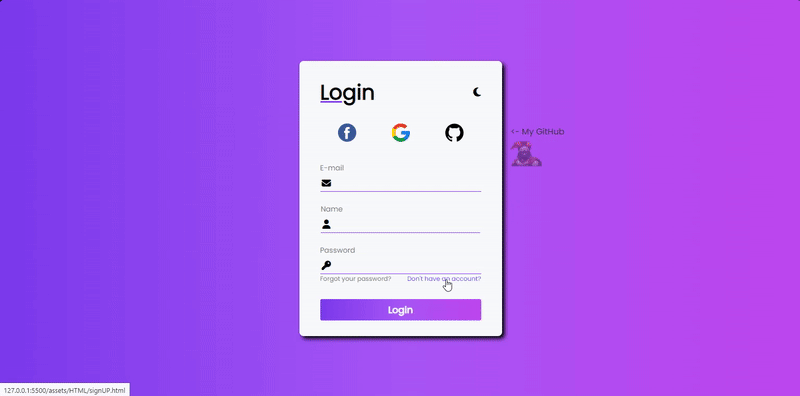
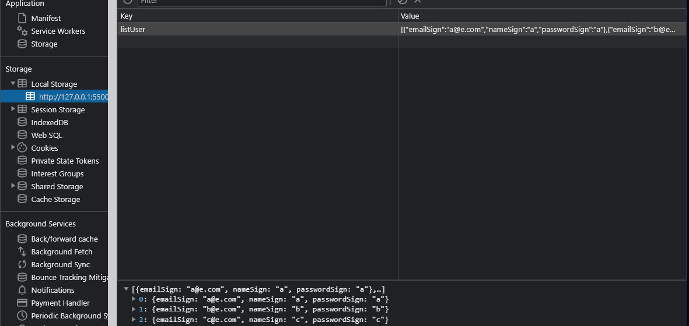

<h1 align="center">registration and login form:</h1>

## 📲 View the project here
<a href="https://devgustavus.github.io/form_login_cadastro/">https://devgustavus.github.io/form_login_cadastro/</a>

## 📖 About the project
This project is a form for login and registration, it has login verification and authentication functionality.<br>
In total, there are 2 HTML pages, one for login and one for registration, and every registration is saved in localStorage as JSON.<br>
This project is responsive to various screens and devices.



### LocalStorage demonstration


## 🦾 Technologies used
<div style="display: flex;">
  


</div>

## 🤔 What i learned
- I learned more about HTML & CSS architecture
- I upgraded my JavaScript abilities to create more interactions on the website
- I learned about the setTimeOut and redirection functions
- I deepened my understanding of localStorage applications
- I had the opportunity to practice more with JSON resources

## 👽 How to clone this project

````bash
    # Select where you want to clone
    $ cd ~/Documents
````

````bash
    # Clone the project
    $ git clone https://github.com/DevGustavus/form_login_cadastro.git
````

````bash
    # Check if cloning worked fine
    $ cd ~/Documents/form_login_cadastro
    $ ls
````
